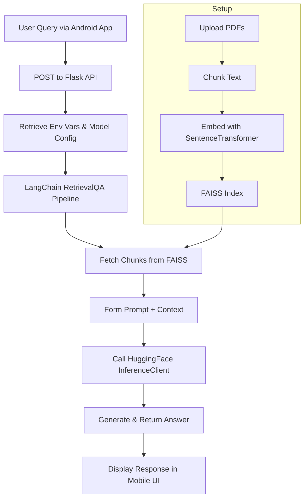

# 🩺 MediBot – AI-Powered Medical Chatbot (Mobile + Flask Backend)

MediBot is an intelligent, generative AI-based medical chatbot that provides accurate, context-aware responses to health-related queries. It integrates state-of-the-art large language models (LLMs) using Retrieval-Augmented Generation (RAG) and delivers real-time answers via an Android app built with WebView.

> ⚠️ Disclaimer: MediBot is an **informational tool** and not a substitute for professional medical advice, diagnosis, or treatment.

---

## 📌 Features

- 🧠 Powered by transformer-based LLMs (e.g., LLaMA-3.1-8B-Instruct)
- 🔍 Context-aware responses using FAISS + LangChain RetrievalQA
- 📱 Android frontend with React Native + WebView
- 🔗 Seamless Flask-based backend integration
- 📂 Dynamic PDF ingestion and semantic embedding creation
- 🌐 Deployed via Hugging Face Inference API

---

## 📐 Architecture Overview



---

## 🛠️ Tech Stack

| Layer       | Technology                            |
|------------|----------------------------------------|
| Frontend   | React Native, WebView, Expo Go         |
| Backend    | Flask, Python, LangChain, dotenv       |
| Embedding  | sentence-transformers, FAISS           |
| LLM        | Hugging Face InferenceClient (LLaMA)   |
| Retrieval  | LangChain RetrievalQA Chain            |
| Storage    | Local FAISS Vectorstore                |

---

## 📂 Folder Structure

```
├── medibot-app/                           # Core logic for embedding + memory management
│   ├── connect_memory_with_llm.py         # Retrieval pipeline with LLM
│   ├── create_memory_for_llm.py           # Embedding medical PDFs into FAISS
│   ├── file.gitignore
│   ├── medibot.py                         # Main interface file
│   ├── test.py
│   ├── README.md
│   ├── requirements.txt
│   ├── data/                              # PDF files for ingestion
│   └── vectorstore/                       # FAISS index storage
│
├── medibot-flask/                         # Flask backend for serving the LLM pipeline
│   ├── app.py                             # Flask API entrypoint
│   ├── requirements.txt                   # Python dependencies
│   ├── .gitignore
│   └── vectorstore/                       # Shared FAISS index
│
├── medibot-react-app/
│   └── medibot-app/                       # React Native frontend
│       ├── App.js                         # Root of the mobile app
│       ├── app/                           # Navigation and screen components
│       ├── assets/                        # Images, icons
│       ├── components/                    # UI components
│       ├── constants/                     # Static configs
│       ├── hooks/                         # React hooks
│       ├── scripts/                       # Any automation/util scripts
│       ├── node_modules/
│       ├── eas.json                       # Expo app config
│       ├── app.json                       # Project manifest
│       ├── package.json                   # JS dependencies
│       ├── tsconfig.json                  # TypeScript config
│       └── README.md

```

---

## 🚀 Getting Started

### 1. Clone the Repository

```bash
git clone https://github.com/<your-username>/medibot.git
cd medibot
```

### 2. Setup the Backend

```bash
cd medibot-flask
python -m venv venv
source venv/bin/activate  # or venv\Scripts\activate on Windows
pip install -r requirements.txt
```

Create a `.env` file:

```env
HF_TOKEN=your_huggingface_api_token
HUGGINGFACE_REPO_ID=meta-llama/Llama-3.1-8B-Instruct
DB_FAISS_PATH=vectorstore/db_faiss
```

Then run:

```bash
python app.py
```

### 3. Generate the Embedding Memory

```bash
python create_memory_for_llm.py
```

### 4. Launch the React Native App

```bash
cd ../medical-chatbot
npm install
npx expo start
```

Scan the QR code on Expo Go app to preview it on your phone.

---

## 📸 Screenshots

> Insert screenshots of:
> - The Android app UI
> - 
> - ▶️ [Click to watch demo video](https://drive.google.com/file/d/1fqR3g9u5Y8XVw8Bmx26TrzGRBb3bP2J4/view?usp=sharing)

> - Web App UI
> - 
> - FAISS creation in terminal
> - Example JSON response

---

## 🧪 Testing

- Use sample PDFs in the `/data/` folder to simulate ingestion.
- Try queries like:
  - “What are the symptoms of dengue?”
  - “How to treat a mild fever?”
- Evaluate response speed, context relevance, and coherence.

---

## 🔄 Future Enhancements

- 🔁 Multi-turn chat memory
- 🌍 Multilingual input/output support
- 🎤 Speech-to-text and text-to-speech capabilities
- 💾 On-device inference using quantized models
- 📊 Feedback loop + model fine-tuning dashboard

---

## 🙋‍♀️ Contributing

1. Fork this repo
2. Create a new branch (`git checkout -b feature/xyz`)
3. Commit your changes (`git commit -m 'Add feature'`)
4. Push to the branch (`git push origin feature/xyz`)
5. Create a pull request!

---

## 📜 License

This project is licensed under the MIT License.

---

## 🙏 Acknowledgements

- [Hugging Face](https://huggingface.co/)
- [LangChain](https://www.langchain.com/)
- [Sentence Transformers](https://www.sbert.net/)
- [Facebook FAISS](https://github.com/facebookresearch/faiss)
